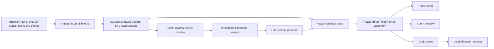

# How the Frame Visualiser works

## Purpose

The application builds a measurable framed-art assembly from supplier moulding
data and shows the same assembly in inspection, room previews, asset review,
local-model review, and offline high-resolution rendering. Artwork, frame SKU,
mount dimensions, profile, and accepted material version remain the product
source of truth across those views.

## Application shell and UI

- `src/pages/index.astro` supplies the Astro page shell.
- `src/components/Visualiser.tsx` owns principal UI state and composes the page.
  It selects artwork, moulding, dimensions, mount, glazing, presentation mode,
  room, review status, and accepted candidate.
- Frame detail, View on wall, Asset review, and Ollama review reuse one selected
  SKU and framed assembly instead of maintaining separate product models.
- `src/styles/global.css` contains the main responsive and review/batch layouts.
  The room calibrator and test centre have focused style files.

Browser storage holds convenience state such as selected SKU, selected batch
items, open batch/benchmark identifiers, and high-resolution job identifiers.
Authoritative review outputs are held by the local server or asset tree.

## Catalogue and supplier assets

- `src/mouldings/catalog.ts` combines Mainline and Centrado data into runtime
  `Moulding` records.
- Supplier, dimensions, profile type, finish, colour tags, source URL, exact-SKU
  images, family images, and material/profile availability are data-driven.
- Generated lookup files in `src/mouldings/*.json` contain catalogue profiles,
  extracted materials, pilot assets, and family references.
- `public/assets/mouldings/<SKU>/` contains profile files, source photographs,
  texture maps, diagnostics, and `variants/` directories.
- A `review-*` variant is immutable. Acceptance changes the active-version
  reference and never removes candidate directories.

## Framed assembly renderer

`src/renderer/FramedArtwork.tsx` is the central React Three Fiber renderer. It:

1. resolves the selected supplier profile and material version;
2. converts millimetres to scene units;
3. builds four mitred rails from the profile cross-section;
4. positions outer mount, optional inner mount, artwork, glazing, backing, and
   rebate closure at separate depths;
5. applies selected material maps and finish-dependent PBR settings;
6. configures the inspection or fixed room camera and lights; and
7. exposes a GLB exporter for the high-resolution render path.

Mount and artwork sit inside the moulding rebate rather than sharing its front
plane. `src/renderer/profileGeometry.ts` contains shared cross-section logic.
Diagnostic modes separate geometry faults from texture and lighting faults.

## Room preview paths

Room definitions live in `src/renderer/roomTemplates.ts`; browser-authored
calibration metadata is coordinated by `roomAdminRegistry.ts` and
`customRoomStore.ts`.

- **Photographic templates** use a room image, placement metadata, calibrated
  projection where available, and a foreground frame render/composite.
- **Generated rooms** use a fixed camera and asset bundle containing a background
  image, environment map, projection/scene metadata, and prepared lighting.
  `GeneratedRoomLighting.tsx` loads the matching light environment.

Mounted generated scenes use `FrameWallContact.tsx`. The floor-standing room uses
`GeneratedRoomLighting.tsx` with real-time 3D shadow mapping onto wall and floor
`ShadowMaterial` receivers, enhanced by a depth-varying optical penumbra shader
in `softWindowShadow.ts`. `LeaningFrameShadow.tsx` provides precise ambient occlusion
crevices for the bottom floor rail and upper wall contact. Room light controls
form, glazing reflection, and shadows; base colour remains supplier-grounded.

## Ollama review and candidate generation

The UI is `src/components/OllamaMaterialReview.tsx`. Local API middleware is
registered by `tools/moulding-material-pilot/plugin.mjs` in `astro.config.mjs`.
The plugin discovers supported vision models and manages jobs, batches,
benchmarks, decisions, recovery, and saved routing policy.

1. The UI sends exact SKU, selected model, editable prompt, and requested scopes
   to `/api/material-review`.
2. Middleware starts `quality_pipeline.py` in the project Python environment.
3. The pipeline assembles exact-SKU references, family references, dimensions,
   existing maps/profile, and diagnostic comparison boards.
4. The vision model returns structured observations, correction plan, scores,
   and findings.
5. Deterministic Python transforms apply bounded changes, generate base-colour,
   bump, roughness and profile candidates, and run image/geometry gates. Up to
   four attempts may be made.
6. Candidate and evidence/report files are saved under
   `public/assets/mouldings/<SKU>/variants/review-*`.
7. The UI presents before/after and history. A user decision updates acceptance
   state and refreshes the viewer to the selected accepted version.

Batches invoke the same single-job path serially. Queue and progress are saved
under `.material-review-batches/`; interrupted active items return paused and
resumable when the dev server reopens. Benchmarks repeat controlled items across
models and can write `.material-review-routing-policy.json`.

## High-resolution rendering

`src/components/HighResRender.tsx` checks `/api/render`, exports the framed
assembly as GLB, and posts it with room, artwork-colour, and glazing settings.
`tools/high-res-render/plugin.mjs` starts Blender with `render.py`, tracks
milestones, and serves the PNG. Temporary embedded source files are discarded;
output and logs remain in ignored `.render-jobs/`.

This path is deterministic for the exported product assembly. AI-enhanced room
preparation is an offline authoring aid, not a runtime redraw of the artwork or
moulding.

## Room and asset authoring tools

- `tools/room-template-generator/` builds generated daylight, sofa, and
  leaning-floor Blender room assets.
- `tools/ai-room-enhancer/` prepares optional AI-refined empty-room imagery and
  validates it before registration.
- `tools/room-calibrator/` analyses photographic wall calibration.
- Mainline and Centrado import/profile tools convert retained supplier evidence
  into the catalogue and auditable per-SKU assets.

## Persistence map

| State | Location | Source of truth |
|---|---|---|
| Catalogue and accepted browser assets | `src/mouldings/`, `public/assets/mouldings/` | Git-tracked files |
| Review candidates and reports | `public/assets/mouldings/<SKU>/variants/review-*` | Immutable files |
| Acceptance/version decisions | `.material-review-state.json` | Local server state |
| Single review jobs | `.material-review-jobs/` | Local ignored records |
| Batch queues | `.material-review-batches/` | Local ignored records |
| Model benchmarks | `.material-review-benchmarks/` | Local ignored records |
| Model routing | `.material-review-routing-policy.json` | Local ignored policy |
| High-resolution jobs | `.render-jobs/` | Local ignored records |
| UI convenience state | browser local/session storage | Browser only |

## Development and verification

`astro.config.mjs` loads React plus material-review and high-resolution middleware
in development and preview. Each server process gets a distinct Vite dependency
cache, so several previews can coexist. The port can change when another instance
is running; follow the URL printed by the relevant process.

Use `SKILLS.md` for task runbooks. Baseline checks are `npm run build`, focused
tests, asset validation for catalogue changes, and direct viewer inspection for
every rendering or layout change.

